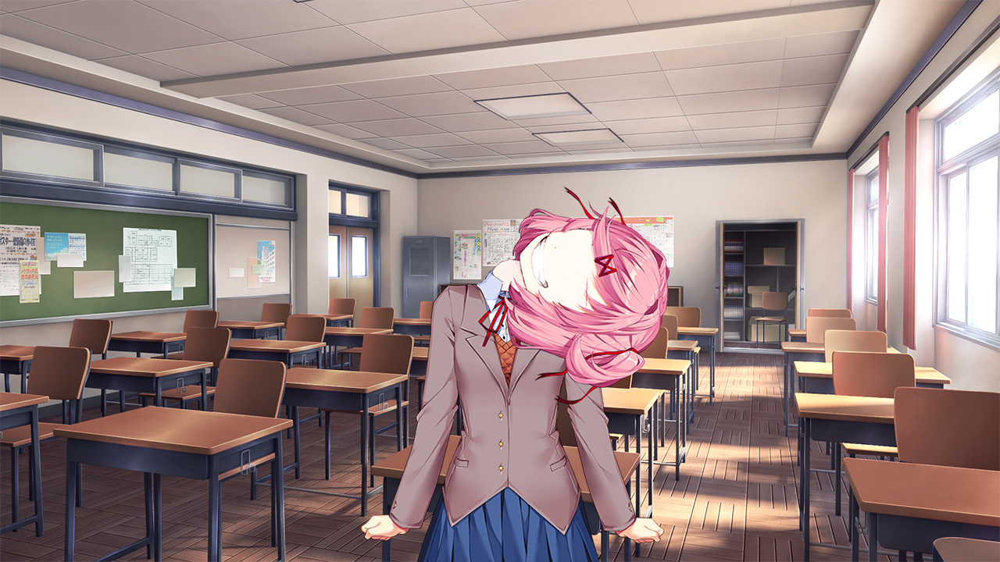
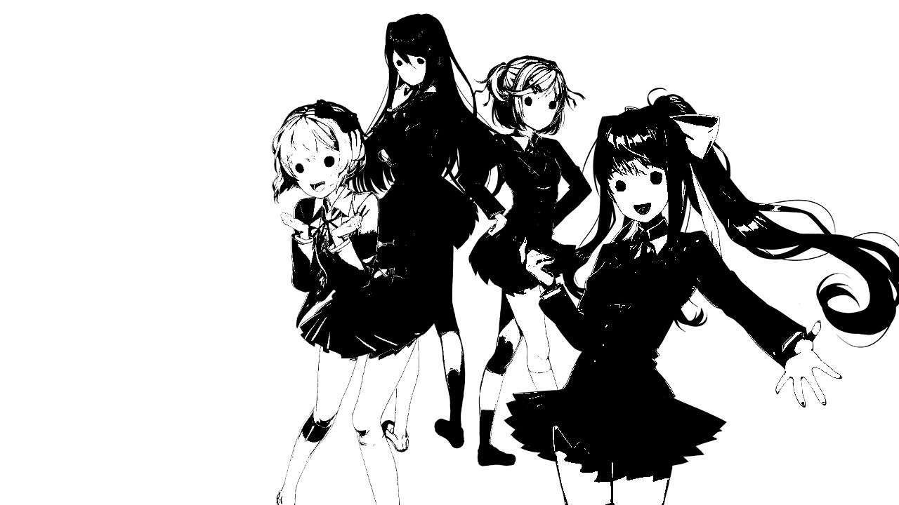

# An Unofficial Parents' Guide to Doki Doki Literature Club

## Introduction

Recently, there has been a large number of news articles about the tragic suicide of a 15-year old boy, who had been known to be a fan of _Doki Doki Literature Club_, otherwise known as _DDLC_ or (less commonly) just _Doki Doki_. Many of these articles are not fully informed of the nature of the game, and a few are spreading outright misinformation. This document aims to clear up any confusion that may have resulted from these articles.

## Contents

1. [Content Warnings](#content-warnings)
2. [The Characters](#the-characters)
3. [Gameplay](#gameplay)
4. [Disturbing events](#disturbing-events)
5. [Common Misconceptions](#common-misconceptions)
6. [Should I let my child play DDLC?](#should-i-let-my-child-play-ddlc)

**Warning: this document will contain spoilers for the entire plot of _Doki Doki Literature Club_, and graphic descriptions as well as images of certain events. Please do not continue reading if you do not want to see this content.**

## Content Warnings

[For the official list of content warnings, click here.](http://ddlc.moe/warning.html)

## The Characters

**Note: all characters are 18 years old.**

### Main Character
You control the main character, who is a fairly one-dimensional boy. The name of this character is selected by you, and he is a separate entity from the player, which becomes important as the game progresses.

### Sayori
Sayori is your cheerful childhood friend, and vice-president of the Literature Club. She is the one who initially invites the main character to join the club, but her real motive is to spend time with the main character, who she is deeply in love with.

Sayori suffers from depression, which appears to lead to her committing suicide by hanging. At this point, the game will appear to end. However, if the player starts a new game, the game will play through as if Sayori never existed, but with various visual glitches and changed dialogue.

### Natsuki
Natsuki is a member of the Literature Club. She is much smaller than the other characters (4'11"), and is an example of the _tsundere_ archetype, meaning she is initially cold towards the main character but eventually warms up to him, becoming more open and emotional.

It is implied that Natsuki is abused by her father, which would contribute to her small stature. She does not die, but depending on how the player interacts with her, a scene may occur in which her neck snaps. This is only temporary and does not affect the progression of the game.

### Yuri
Yuri is a member of the literature club. She is relatively mature compared to Sayori and Natsuki, in behaviour and figure, and is quiet and shy.

Yuri has a collection of knives. The player eventually learns that Yuri cuts herself with these knives, and she eventually stabs herself to death after confessing her love to the main character, regardless of whether her confession is accepted or rejected.

### Monika
Monika is the president of the Literature Club, and the primary antagonist of the game. Her name and appearance is deliberately different from the other members of the club, which intentionally makes her appear out of place.

Monika is revealed to be self aware and in control the game code, and in love with the _player_, as opposed to the main character. She reveals that she was the one who orchestrated the deaths of the other girls, by manipulating their personalities to try and make them less likable, in order to win the heart of the player. After this failed, she forced them to either kill themselves or scare the player in such a way that they would no longer like anyone but her. Eventually, she deletes all of the other girls from the game and forces the player to spend time with her. The player must delete her character file in order to proceed with the game.

## Gameplay

### Story

The game is split into four "acts", plus a credits scene.

* Act 1 - The game plays out as normal, until Sayori's suicide.
* Act 2 - The game plays out similarly to act 1, but Sayori is either glitched or missing, continuing until Yuri's suicide.
* Act 3 - The player is trapped in a room with Monika until her character file is deleted.
* Act 4 - Normally, Sayori will inherit the role of club president, and will attempt to trap the player in the same room, but with her instead of Monika. If the player has saved and loaded enough times to view all the available scenes in the game, she will instead thank the player for spending so much time with all the girls.
* Credits - Monika sings a song ([Your Reality](https://www.youtube.com/watch?v=CAL4WMpBNs0)) to the player as the credits roll.

The game is a visual novel, meaning the player must click through lines of dialogue to progress through the game. At certain points, the game may provide the player a list of options to choose from, but, other than occasionaly viewing a few different scenes, this does not affect the progression of the game, which follows a mostly linear path.

After Sayori's suicide, the player will encounter various scenes with disturbing graphical glitches and changed dialogue, as a result of Monika's changes to the game.

### Poem-Writing

After each day, the player writes a poem to show to the other girls. This involves selecting 20 different words. If the player picks words that particularly appeal to one of the girls, a special scene featuring that girl will be unlocked.

After Sayori's suicide, the poem-writing game may encounter visual glitches or play unsettling sound effects. This is deliberate.

## Disturbing events

### Sayori's suicide

Sayori commits suicide by hanging. Her corpse is shown in fairly graphic detail, with blood on her hands and a noose around her neck, while unsettling music ([Sayo-nara](https://www.youtube.com/watch?v=al1BNB8bKaE)) plays.

### Yuri's suicide

Yuri commits suicide by stabbing herself. Her corpse is shown in graphic detail, and the player is forced to watch as her blood slowly congeals over the course of a weekend.

### Natsuki's neck-snap

Depending on how the player writes their poems, they may encounter a scene in which Natsuki's neck suddenly snaps. She also has no facial features at this point. The game continues after this as if nothing ever happened.

### Monika Jumpscare

If the player is using screen-recording software, Monika will perform a jumpscare in Act 3.

### Eyes popping out

If Natsuki doesn't like your poem in Act 2, her eyes may pop out while she reads it.

### Realistic mouths and eye glitches

Natsuki may randomly say what appears to be random words while her face encounters visual distortions.

### Disturbing character stickers

This image has the chance of appearing in the poem-writing game.

### Yuri's eyes

This only occurs if the player manages to select an option other than Monika when the cursor is rigged in Act 2.

### Strange images on the main menu

There is a chance these images may appear on the game's menu.

**For a more comprehensive list of different "easter eggs", [this article](http://doki-doki-literature-club.wikia.com/wiki/Easter_Eggs) lists most, if not all, of them.**

## Common Misconceptions

Several news outlets have produced articles about _Doki Doki Literature Club_ after the announcement that it may have been contributed to the death of a 15 year old. Some of these have blatantly wrong information, which this section aims to clear up.

### The game is aimed at children

The art style of the game may at first appear like it is aimed at children. However, the game's download page explicitly states that children (or those who are easily disturbed) should not play it.

### The game is available on phones / tablets

The game is only available on computers (Windows, Mac, Linux).

### The game can send messages to your phone encouraging you to carry out certain tasks

**This is completely false**. This misconception may be due to confusion between _Doki Doki Literature Club_ and another visual novel, _Mystic Messenger_, which is a mobile game that includes this feature.

### The game is online / multiplayer

_Doki Doki Literature Club_ is an offline, singleplayer game. There are no online interactions whatsoever.

### The game makes changes to your computer

This misconception is possibly the closest to the truth. During the course of the game, the player may encounter scenarios such as fake computer crashes, or menus that only allow you to select one particular option by moving your cursor. However, none of these changes persist after the game is closed.

Furthermore, in order to progress within the game, the player needs to make changes to the game's files. There is no need to change any other files on the system, though.

## Should I let my child play DDLC?

After reviewing the content shown above, I believe that you should be able to make an informed decision. However, your child's needs may differ, so if you believe they are playing _Doki Doki Literature Club_, and you are unsure whether it is suitable for them, you should discuss the matter with them.

As a rule of thumb, if your child is old enough to be using the internet unsupervised, they are likely to be old enough to play _Doki Doki Literature Club_, but this may vary between person to person.
